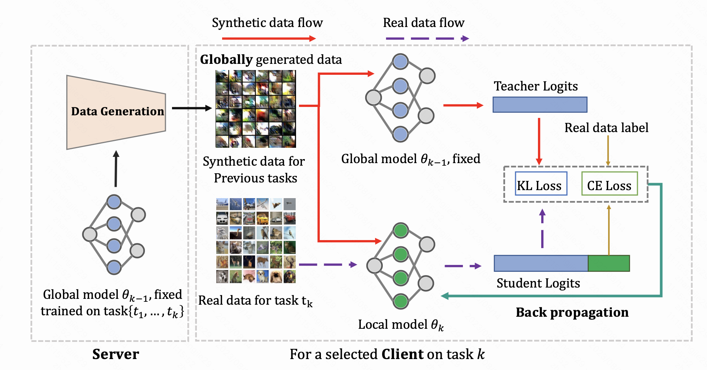

This repository is the official PyTorch implementation of:

[TARGET: Federated Class-Continual Learning via Exemplar-Free Distillation](https://arxiv.org/abs/2303.06937) (ICCV 2023).

# Abstract

This paper focuses on an under-explored yet important problem: Federated Class-Continual Learning (FCCL), where new classes are dynamically added in federated learning. 
Existing FCCL works suffer from various limitations, such as requiring additional datasets or storing the private data from previous tasks. In response, we first demonstrate that non-IID data exacerbates catastrophic forgetting issue in FL. Then we propose a novel method called TARGET (federat**T**ed cl**A**ss-continual lea**R**nin**G** via **E**xemplar-free dis**T**illation), which alleviates catastrophic forgetting in FCCL while preserving client data privacy. Our proposed method leverages the previously trained global model to transfer knowledge of old tasks to the current task at the model level. Moreover, a generator is trained to produce synthetic data to simulate the global distribution of data on each client at the data level. Compared to previous FCCL methods, TARGET does not require any additional datasets or storing real data from previous tasks, which makes it 
ideal for data-sensitive scenarios.


# Reproducing
We test the code on V100 GPU with pytorch: 
```
torch==2.0.1
torchvision==0.15.2
```

## Baseline
Here, we provide a simple example for different methods. 
For example, for `cifar100-5tasks`, please run the following commands to test the model performance with non-IID (`$\beta=0.5$`) data.

```
#!/bin/bash
# method= ["finetue", "lwf", "ewc", "icarl"]

CUDA_VISIBLE_DEVICES=0 python main.py --wandb=1 --group=5tasks_cifar100 --method=$method --tasks=5 --beta=0.5
```

### Ours
```
CUDA_VISIBLE_DEVICES=0 python main.py --wandb=1 --group=5tasks_cifar100 --method=ours --tasks=5  --beta=0.5 --nums=8000 --kd=25 --exp_name=25_kd_8k_data
```


# Citation
```
@InProceedings{Zhang_2023_ICCV,
    author    = {Zhang, Jie and Chen, Chen and Zhuang, Weiming and Lyu, Lingjuan},
    title     = {TARGET: Federated Class-Continual Learning via Exemplar-Free Distillation},
    booktitle = {Proceedings of the IEEE/CVF International Conference on Computer Vision (ICCV)},
    month     = {October},
    year      = {2023},
    pages     = {4782-4793}
}
```
